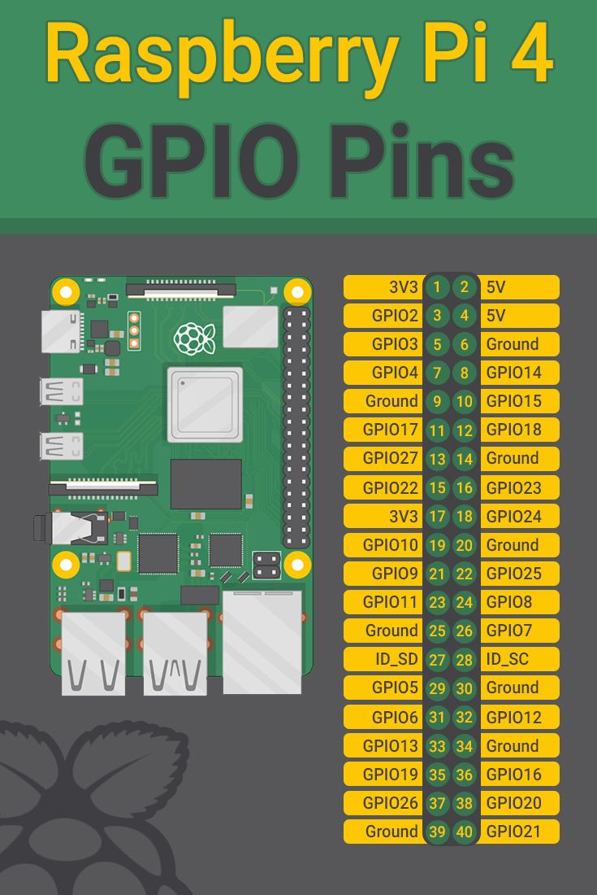

# rosCAR
# The modified version is available under ~/src/PinOuts.xlsx

|GPIO Pin # | Board Pin # | Purpose                    | Wire Color|
|-------    | --------    | ------------------         | -------   |
|21         | 40          |Left PWM Drive              | White     |
|26         | 37          |Left Forward                | Yellow    |
|19         | 35          |Left Reverse                | Green     |
|12         | 32          |Right PWM Drive             | Blue      |
|13         | 33          |Left Forward                | brown     |
|6          | 31          |Left Reverse                | Orange    |
|NA         | 2           |5V supply to HC-SR04        | Red       |
|NA         | 6           |GND for HC-SR04             | Black     |
|NA         | 17          |3.3V Power for case fan     | Red       |
|NA         | 20          |GND for case fan            | Black     |
|4          | 7           |Trigger for HC SR04         | Blue      |
|NA         | 9           |GND for L298N               | Black     |
|17         | 11          |Echo from Right SR04        | White     |
|27         | 13          |Echo from Center SR04       | White     |
|22         | 15          |Echo from Left SR04         | White     |

